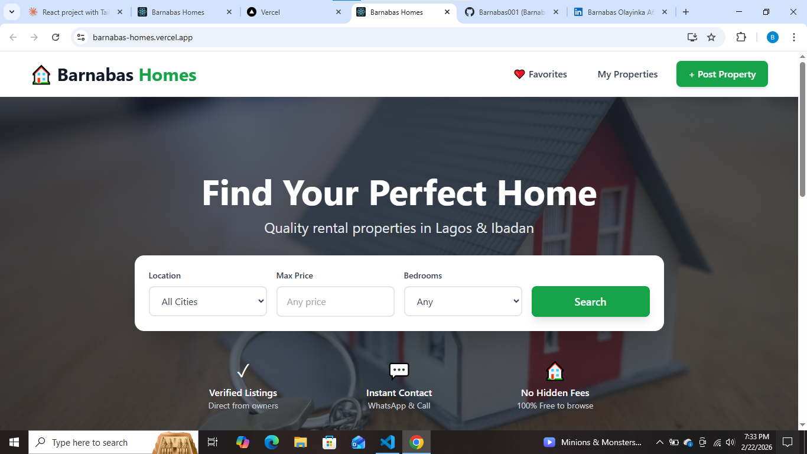
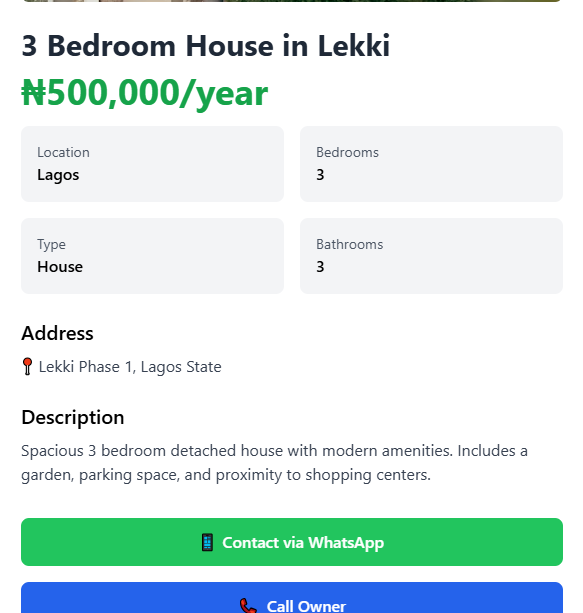
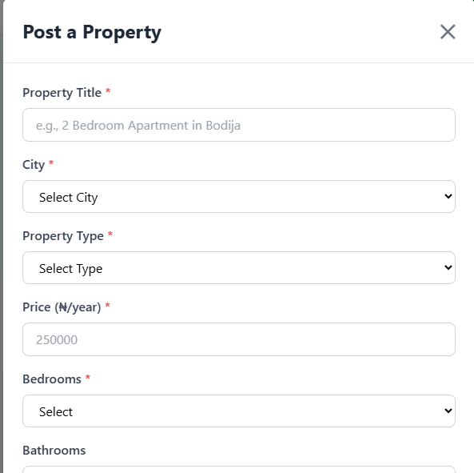
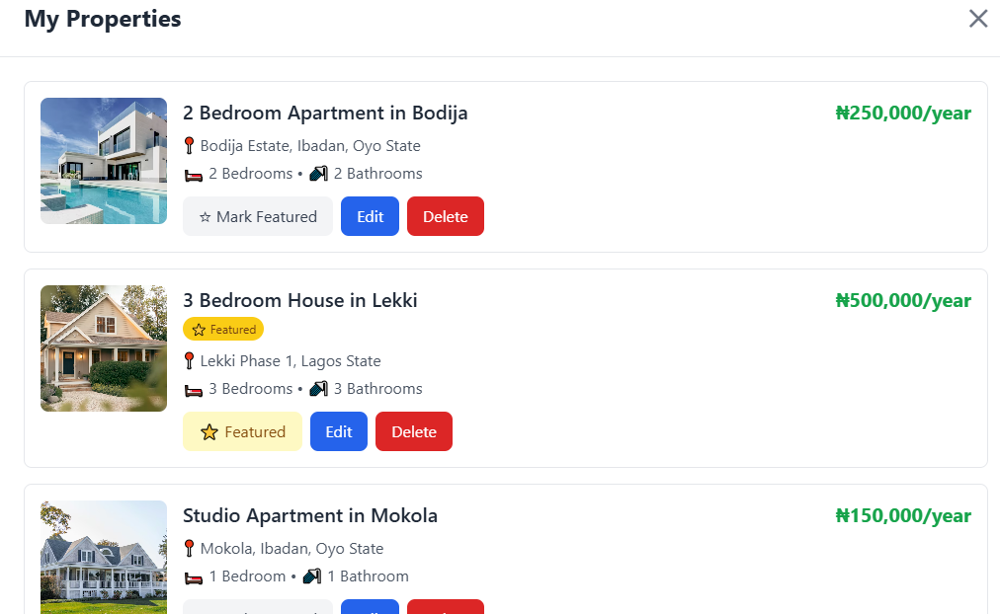

# 🏠 Barnabas Homes

A modern real estate platform connecting property owners with prospective tenants in Lagos and Ibadan, Nigeria.



## 🌟 Live Demo

**[View Live Site](https://barnabas-homes.vercel.app/)**

---

## 📖 About The Project

Barnabas Homes solves the frustrating house-hunting experience in Southwest Nigeria by providing a direct platform where:

- 🏠 Landlords can post properties with photos and details
- 🔍 Tenants can search and filter by location, price, and bedrooms
- ❤️ Users can save favorite properties for later
- 📱 Direct contact via WhatsApp or phone - no middlemen

Built as a learning project to master React, TypeScript, and modern web development patterns.

---

## ✨ Features

### For Tenants

- ✅ Browse all available properties with images
- ✅ Search by city (Lagos/Ibadan)
- ✅ Filter by price range and number of bedrooms
- ✅ View detailed property information
- ✅ Save favorite properties
- ✅ Direct contact with property owners (WhatsApp/Phone)

### For Landlords

- ✅ Post new property listings
- ✅ Upload multiple property images
- ✅ Edit existing listings
- ✅ Delete listings
- ✅ Mark properties as "Featured" for premium visibility
- ✅ Manage all listings in one dashboard

### Additional Features

- 📊 Real-time property statistics
- 🎨 Smooth scroll animations
- 💾 Data persistence with localStorage
- 📱 Fully responsive design (mobile, tablet, desktop)
- ⚡ Featured properties appear first in search results

---

## 🛠️ Built With

- **React 18** - Frontend framework
- **TypeScript** - Type safety and better developer experience
- **Tailwind CSS** - Utility-first styling
- **Vercel** - Deployment and hosting
- **localStorage** - Data persistence (MVP phase)

---

## 📸 Screenshots

### Homepage


### Property Details



### Post Property



### My Properties Dashboard



### Favorites

---

## 🚀 Getting Started

### Prerequisites

- Node.js (v18 or higher)
- npm or yarn

### Installation

1. Clone the repository

```bash
git clone https://github.com/yourusername/barnabas-homes.git
cd barnabas-homes
```

2. Install dependencies

```bash
npm install
```

3. Start the development server

```bash
npm start
```

4. Open [http://localhost:3000](http://localhost:3000) in your browser

---

## 📁 Project Structure

```
barnabas-homes/
├── src/
│   ├── components/
│   │   ├── Header.tsx              # Main navigation
│   │   ├── HomePage.tsx            # Main page component
│   │   ├── SearchSection.tsx       # Search hero section
│   │   ├── SearchBar.tsx           # Search filters
│   │   ├── PropertyGrid.tsx        # Property list grid
│   │   ├── PropertyCard.tsx        # Individual property card
│   │   ├── PropertyDetail.tsx      # Property detail modal
│   │   ├── PostPropertyForm.tsx    # Create/edit property form
│   │   ├── MyProperties.tsx        # Property management dashboard
│   │   ├── MyFavorites.tsx         # Favorites modal
│   │   ├── StatsSection.tsx        # Statistics display
│   │   ├── ScrollReveal.tsx        # Scroll animation component
│   │   └── Footer.tsx              # Site footer
│   ├── App.tsx
│   └── index.tsx
├── public/
├── package.json
└── README.md
```

---

## 💡 Key Learnings

### Technical Skills Developed

- Component-based architecture and composition
- State management with useState and useEffect
- TypeScript interfaces and type safety
- Form handling and validation
- localStorage for data persistence
- Responsive design patterns
- CSS animations and transitions

### React Patterns Applied

- Component composition (breaking UI into small, reusable pieces)
- Props drilling and lifting state up
- Conditional rendering
- List rendering with keys
- Event handling and propagation
- Cleanup functions in useEffect
- Custom scroll reveal animations

### Challenges Overcome

- **Image loading issues**: Learned about external resource reliability and fallbacks
- **localStorage sync**: Implemented version control for data migrations
- **Component refactoring**: Broke down monolithic components into smaller, focused ones
- **TypeScript errors**: Improved understanding of type definitions and interfaces

---

## 🔮 Future Enhancements

### Phase 2 (Backend Integration)

- [ ] Firebase/Supabase integration for real database
- [ ] User authentication (login/signup)
- [ ] Image upload to cloud storage
- [ ] Real-time updates

### Phase 3 (Advanced Features)

- [ ] Property reviews and ratings
- [ ] Advanced search (amenities, property age)
- [ ] Map integration for location viewing
- [ ] Email notifications
- [ ] Payment integration for featured listings

### Phase 4 (Scaling)

- [ ] Expand to more Nigerian cities
- [ ] Admin dashboard
- [ ] Analytics for property owners
- [ ] Mobile app (React Native)

---

## 🤝 Contributing

This is a learning project, but feedback and suggestions are welcome!

1. Fork the project
2. Create your feature branch (`git checkout -b feature/AmazingFeature`)
3. Commit your changes (`git commit -m 'Add some AmazingFeature'`)
4. Push to the branch (`git push origin feature/AmazingFeature`)
5. Open a Pull Request

---

## 📝 License

This project is open source and available under the MIT License.

---

## 👤 Author

**Barnabas Olayinka**

- GitHub: https://github.com/Barnabas001
- LinkedIn: https://www.linkedin.com/in/barnabas-olayinka-affonshike/

---

## 🙏 Acknowledgments

- Built as part of my journey learning React and TypeScript
- Inspired by the real problem of difficult house hunting in Nigeria
- Design inspiration from Zillow and Realtor.com
- Frontend Mentor for providing project-based learning challenges

---

## 📊 Project Stats

- **Lines of Code**: ~1,500+
- **Components**: 15+
- **Development Time**: 2-3 weeks
- **Features**: 11 major features
- **Status**: MVP Complete ✅

---

**Built with ❤️ by BARNABAS OLAYINKA - February 2026**
